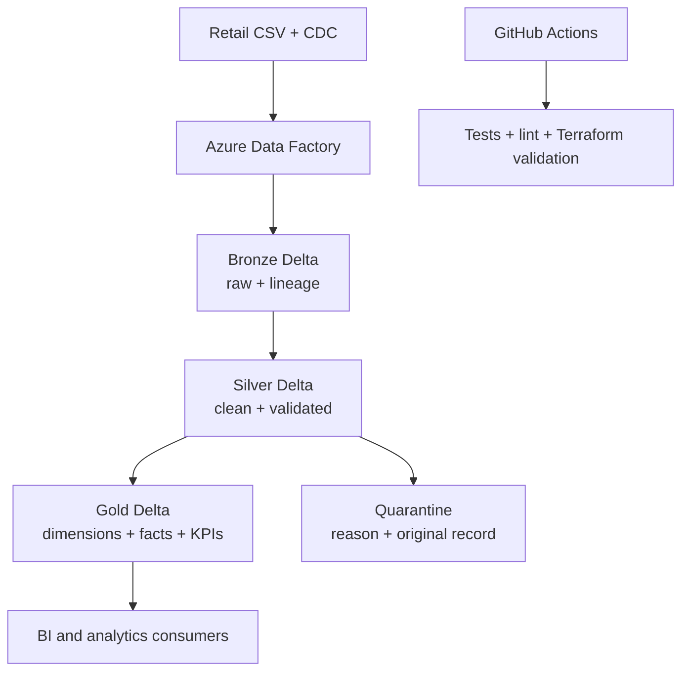

# Azure Lakehouse Data Pipeline

[](https://github.com/sathvikareddy577-jpg/azure-lakehouse-data-pipeline/actions/workflows/ci.yml)
[](https://www.python.org/)
[](https://spark.apache.org/)
[](https://delta.io/)

A tested retail data-engineering portfolio project that turns raw customer,
product, order, and CDC data into trustworthy analytics tables. It combines a
locally reproducible PySpark + Delta Lake pipeline with deployable templates for
ADLS Gen2, Azure Databricks, Azure Data Factory, managed identities, and
Terraform.

> **Honest scope:** the repository runs locally with synthetic data. The Azure
> files are infrastructure and orchestration templates; deploying them requires
> an Azure subscription and creates billable resources. No live production
> customer data or cloud credentials are included.

## What this project proves

| Capability | Implementation | Verification |
|---|---|---|
| Medallion architecture | Bronze → Silver → Gold Delta tables | End-to-end integration test |
| Replay safety | SHA-256 record identity + Bronze Delta MERGE | Same file ingested twice without row growth |
| Data quality | Required fields, type/range rules, and foreign-key checks | Rejected records written to entity quarantine tables |
| CDC | INSERT, UPDATE, soft DELETE, duplicate-event filtering | Delta MERGE integration tests |
| Analytics model | Customer/product dimensions, order fact, daily KPI | Count and revenue reconciliation |
| Cloud orchestration | ADF Databricks Notebook activities with dependencies | Static JSON contract tests + CI validation |
| Infrastructure as code | ADLS Gen2, Databricks, ADF, identities, RBAC | `terraform fmt` and `terraform validate` in CI |
| Engineering quality | Deterministic fixtures, linting, compilation, CI matrix | 42 fast tests, 7 Delta integration tests, 86% unit coverage |

## Architecture



The local runner follows the same logical stages without requiring an Azure
account. In Azure, ADF controls stage order and Azure Databricks performs the
Spark work against ADLS Gen2. Managed identities replace embedded storage keys.

## Business scenario

A retailer receives daily customer, product, and order files plus customer
change events from a CRM. Analysts need accurate daily revenue and customer
activity, while engineers need safe retries and visibility into rejected rows.

The pipeline applies these decisions:

1. **Bronze preserves source values.** Every source field is read as text so a
   malformed amount or date reaches the quality layer instead of disappearing.
2. **Lineage is attached immediately.** Source system, file, ingest timestamp,
   ingest date, and a deterministic record hash travel with every Bronze row.
3. **Silver owns trust.** Values are standardized and cast, invalid records are
   quarantined, order keys are checked against customers and products, and
   business keys are deduplicated.
4. **CDC changes current customer state.** Updates preserve attributes omitted
   by the event, deletes are soft, and duplicate event IDs are collapsed before
   Delta MERGE.
5. **Gold refuses bad totals.** The job reconciles order count and revenue
   between `fact_orders` and `daily_sales_kpi` before publishing tables.

## Repository map

```text
azure-lakehouse-data-pipeline/
├── src/
│   ├── bronze/                 # Replay-safe raw ingestion
│   ├── silver/                 # Transformations, validation, CDC, quarantine
│   ├── gold/                   # Dimensions, fact, KPIs, reconciliation
│   ├── common/                 # Spark, logging, and configuration helpers
│   └── data_models/            # Explicit Spark data contracts
├── scripts/
│   ├── generate_sample_data.py # Seeded synthetic retail + CDC generator
│   ├── run_pipeline.py         # Stage-aware local orchestrator
│   └── local_demo.py           # One-command demonstration
├── tests/                      # Unit, contract, cloud, and Delta integration tests
├── azure/
│   ├── data_factory/           # ADF pipeline and managed-identity linked services
│   ├── databricks/             # Parameterized notebook, job, and Auto Loader helper
│   └── terraform/              # Azure infrastructure and RBAC
├── docs/
│   ├── architecture.md         # Design choices and failure behavior
│   ├── deployment.md           # Safe Azure deployment checklist
│   ├── interview-guide.md      # Natural project explanation and questions
│   └── validation-report.md    # Reproducible quality evidence
└── .github/workflows/ci.yml    # Python matrix, Delta tests, and Terraform validation
```

## Run it locally

### Prerequisites

- Python 3.10, 3.11, or 3.12
- Java 17
- Git
- Internet access on the first Delta run so Spark can download the matching JVM
  package

### Windows PowerShell

```powershell
git clone https://github.com/sathvikareddy577-jpg/azure-lakehouse-data-pipeline.git
cd azure-lakehouse-data-pipeline
py -3.12 -m venv .venv
.\.venv\Scripts\Activate.ps1
python -m pip install -r requirements-dev.txt
python scripts\local_demo.py
```

### macOS or Linux

```bash
git clone https://github.com/sathvikareddy577-jpg/azure-lakehouse-data-pipeline.git
cd azure-lakehouse-data-pipeline
python3 -m venv .venv
source .venv/bin/activate
python -m pip install -r requirements-dev.txt
python scripts/local_demo.py
```

The demo generates a smaller dataset, executes the entire medallion flow with
CDC, reconciles Gold totals, and runs the fast test suite.

### Run individual commands

```bash
# Generate the full deterministic dataset
python scripts/generate_sample_data.py --seed 42

# Run the complete pipeline
python scripts/run_pipeline.py \
  --layer full \
  --raw-data-path data/raw \
  --warehouse-path data/warehouse \
  --cdc-path data/cdc/customer_cdc_events.json

# Rerun only one stage
python scripts/run_pipeline.py --layer bronze
python scripts/run_pipeline.py --layer silver
python scripts/run_pipeline.py --layer gold
```

## Expected local outputs

```text
data/warehouse/
├── bronze/
│   ├── bronze_customers/
│   ├── bronze_products/
│   └── bronze_orders/
├── silver/
│   ├── silver_customers/
│   ├── silver_products/
│   └── silver_orders/
├── quarantine/
│   ├── customers/
│   ├── products/
│   └── orders/
└── gold/
    ├── dim_customer/
    ├── dim_product/
    ├── fact_orders/
    └── daily_sales_kpi/
```

The generator intentionally creates a blank customer email, a negative product
price, an invalid order date, a negative order amount, and orphan customer and
product references. Those rows demonstrate quarantine behavior; they are not
accidental bad test data.

## Testing and evidence

```bash
# Fast transformation, contract, and cloud-template tests
pytest -m "not integration" -q --cov=src --cov-report=term-missing

# Delta-backed replay, CDC, and complete-pipeline tests
RUN_DELTA_TESTS=1 pytest -m integration -q

# Code quality
ruff check .
python -m compileall -q src scripts azure/databricks tests

# Azure template syntax
find azure -name '*.json' -print0 | xargs -0 -n1 jq empty
terraform -chdir=azure/terraform fmt -check -recursive
terraform -chdir=azure/terraform init -backend=false
terraform -chdir=azure/terraform validate
```

CI runs fast tests on Python 3.10 and 3.12, runs Delta integration tests in a
separate clean process, and validates the infrastructure templates. See
[`docs/validation-report.md`](docs/validation-report.md) for the baseline audit
and current evidence.

## Data contracts and quality rules

| Entity | Required values | Business rules | Business key |
|---|---|---|---|
| Customer | ID, name, email, age, country | Age 18–120 | `customer_id` |
| Product | ID, name, category, unit price | Price 0.01–1,000,000 | `product_id` |
| Order | ID, customer, product, date, amount, quantity | Amount ≥ 0; quantity ≥ 1; valid dimension references | `order_id` |

Each quarantine row contains:

- entity name;
- record ID when available;
- the original record serialized as JSON;
- a human-readable rejection reason; and
- rejection timestamp.

## CDC behavior

The customer CDC contract contains `event_id`, `customer_id`, `operation`,
optional changed attributes, `event_timestamp`, and `source_system`.

| Operation | Result |
|---|---|
| `INSERT` | Adds a complete customer only when the ID is absent |
| `UPDATE` | Updates supplied attributes and preserves omitted values |
| `DELETE` | Sets `is_deleted=true` and closes `end_date` |
| Duplicate event | Deduplicated by `event_id`; replay keeps the same row count |
| Multiple events for one customer in a batch | Latest `event_timestamp` wins |

## Azure deployment

The Terraform plan creates billable resources. Inspect the plan and estimated
cost before applying it.

```bash
az login
az account set --subscription "<subscription-id>"

cd azure/terraform
terraform init
terraform fmt -check -recursive
terraform validate
terraform plan -out lakehouse.tfplan
# Only after reviewing the plan:
terraform apply lakehouse.tfplan
```

After provisioning:

1. Sync this repository into Azure Databricks Repos.
2. Replace `<user>` in the ADF and Databricks notebook paths.
3. Use Terraform outputs for the storage account, workspace URL, and workspace
   resource ID.
4. Configure the ADF linked-service parameters.
5. Grant the Data Factory managed identity access to Azure Databricks.
6. Trigger with development-sized compute, inspect quarantine and Gold outputs,
   then pause or destroy resources when finished.

Detailed steps and rollback guidance are in
[`docs/deployment.md`](docs/deployment.md).

## Security choices

- No passwords, tokens, storage keys, or Terraform state are committed.
- ADF and Databricks storage access uses managed identities and Azure RBAC.
- Databricks workflow schedules are **paused by default** to prevent surprise
  compute charges.
- `.env`, local data, logs, state, and workspace artifacts are ignored by Git.
- Shared-key access is disabled in the Terraform storage account.

## Interview-ready summary

> I built a retail Azure lakehouse using PySpark and Delta Lake. Raw customer,
> product, order, and CRM CDC data enters Bronze with lineage and replay-safe
> hashes. Silver standardizes types, enforces business and referential rules,
> sends invalid records to quarantine, and applies idempotent customer CDC with
> Delta MERGE. Gold creates customer and product dimensions, an order fact, and
> daily sales KPIs, then reconciles order counts and revenue before publishing.
> Azure Data Factory orchestrates Databricks stages, Terraform provisions ADLS,
> Databricks, ADF, identities and RBAC, and GitHub Actions verifies both code and
> infrastructure.

For follow-up questions and natural answers, see
[`docs/interview-guide.md`](docs/interview-guide.md).

## Project status

- Local unit, transformation, contract, and static cloud tests: verified
- Delta integration suite: automated in GitHub Actions
- Terraform plan/validation: automated in GitHub Actions
- Live Azure deployment: intentionally not claimed; requires the repository
  owner's subscription and explicit cost approval

## Author

**Sathvika Reddy Gaddam** — Data Engineering portfolio project

## License

MIT — see [`LICENSE`](LICENSE).
