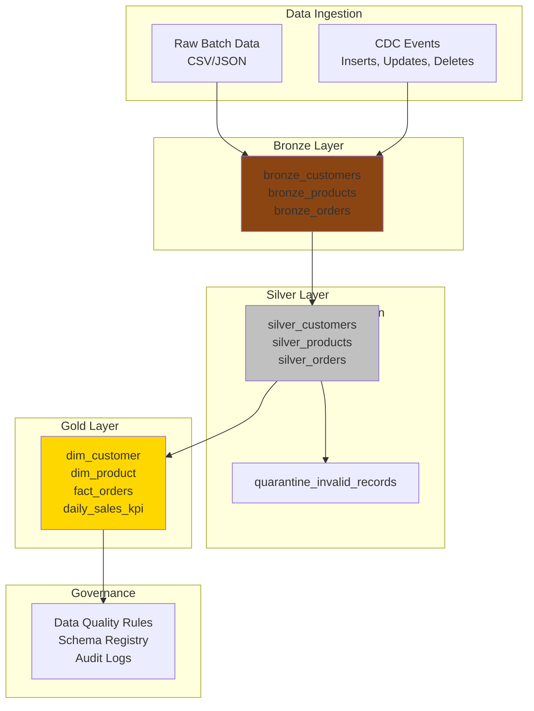

# Azure Lakehouse Data Pipeline

A professional, production-ready Data Engineering project demonstrating the Medallion Architecture (Bronze → Silver → Gold) with Apache Spark, Delta Lake, and Azure cloud infrastructure. This portfolio project showcases enterprise-grade data pipeline patterns, data quality enforcement, and CDC (Change Data Capture) handling.

## Architecture Overview



## Business Scenario

A retail company needs a data pipeline to:
- **Ingest** customer, product, and order data from multiple sources
- **Transform** raw data into clean, standardized formats with data-quality validation
- **Handle CDC** events (customer updates, product changes, order corrections)
- **Build analytics** tables (customer dimensions, product dimensions, fact orders, daily KPIs)
- **Ensure idempotency** so rerunning pipelines doesn't create duplicates
- **Audit and quarantine** invalid records for investigation

## Project Folder Structure

```
├── src/
│   ├── __init__.py
│   ├── common/
│   │   ├── __init__.py
│   │   ├── logging.py              # Centralized logging
│   │   ├── spark_utils.py          # Spark session management
│   │   └── config.py               # Configuration management
│   ├── data_models/
│   │   ├── __init__.py
│   │   └── schemas.py              # Spark StructTypes for all layers
│   ├── bronze/
│   │   ├── __init__.py
│   │   └── ingest.py               # Raw data ingestion to Bronze
│   ├── silver/
│   │   ├── __init__.py
│   │   ├── validate.py             # Data quality rules
│   │   └── transform.py            # Silver layer transformations
│   └── gold/
│       ├── __init__.py
│       ├── dimension_tables.py      # dim_customer, dim_product
│       └── fact_tables.py           # fact_orders, daily_sales_kpi
├── tests/
│   ├── __init__.py
│   ├── conftest.py                 # Pytest fixtures
│   ├── test_schemas.py             # Schema validation tests
│   ├── test_bronze_ingest.py       # Bronze layer tests
│   ├── test_silver_transforms.py   # Silver layer tests
│   ├── test_gold_aggregations.py   # Gold layer tests
│   ├── test_data_quality.py        # Data quality rule tests
│   ├── test_cdc_handling.py        # CDC idempotency tests
│   └── fixtures/
│       └── sample_data.py          # Test data generation
├── data/
│   ├── raw/                        # Source data
│   │   ├── customers.csv
│   │   ├── products.csv
│   │   └── orders.csv
│   ├── cdc/                        # CDC events
│   │   ├── customer_cdc_events.json
│   │   └── order_cdc_events.json
│   └── warehouse/                  # Delta Lake tables
│       ├── bronze/
│       ├── silver/
│       └── gold/
├── azure/
│   ├── data_factory/
│   │   ├── pipeline_main.json      # ADF pipeline
│   │   └── linked_services.json    # ADLS Gen2 connection
│   ├── databricks/
│   │   ├── notebook_main.py        # Databricks notebook
│   │   ├── job_config.json         # Databricks job config
│   │   └── autoloader_config.py    # Auto Loader setup
│   └── terraform/
│       ├── main.tf                 # ADLS, Databricks cluster
│       ├── variables.tf
│       └── outputs.tf
├── scripts/
│   ├── local_demo.py               # Windows-friendly demo script
│   ├── generate_sample_data.py     # Synthetic data generation
│   └── run_pipeline.py             # Pipeline orchestration
├── .github/
│   └── workflows/
│       └── ci.yml                  # GitHub Actions CI
├── .gitignore
├── .env.example
├── requirements.txt
├── setup.py
├── LICENSE
└── pytest.ini
```

## Setup Instructions

### Prerequisites

- **Python 3.8+** (tested on 3.9, 3.10)
- **Java 11+** (required by PySpark)
- **Git**

### Local Development Setup

1. **Clone the repository:**
   ```bash
   git clone https://github.com/sathvikareddy577-jpg/azure-lakehouse-data-pipeline.git
   cd azure-lakehouse-data-pipeline
   ```

2. **Create a virtual environment:**
   ```bash
   python -m venv venv
   source venv/bin/activate  # On Windows: venv\Scripts\activate
   ```

3. **Install dependencies:**
   ```bash
   pip install -r requirements.txt
   ```

4. **Copy environment template:**
   ```bash
   cp .env.example .env
   ```

5. **Run the local demo (Windows-friendly):**
   ```bash
   python scripts/local_demo.py
   ```

### Running the Full Pipeline Locally

```bash
python scripts/run_pipeline.py \
  --data-path ./data \
  --warehouse-path ./data/warehouse \
  --mode full
```

### Running Tests

```bash
# Run all tests
pytest tests/ -v

# Run specific test suite
pytest tests/test_silver_transforms.py -v

# Run with coverage
pytest tests/ --cov=src --cov-report=html
```

### Running Linting

```bash
# Code style checks
flake8 src/ --max-line-length=120

# Type checking
mypy src/ --ignore-missing-imports
```

## Sample Commands and Expected Outputs

### 1. Generate Synthetic Data

```bash
python scripts/generate_sample_data.py --output-dir ./data/raw
```

**Output:**
```
Generated 1000 customers → data/raw/customers.csv
Generated 500 products → data/raw/products.csv
Generated 5000 orders → data/raw/orders.csv
Generated 50 CDC customer events → data/cdc/customer_cdc_events.json
Generated 100 CDC order events → data/cdc/order_cdc_events.json
```

### 2. Run Bronze Ingest

```bash
python scripts/run_pipeline.py --layer bronze
```

**Output:**
```
✓ Bronze customers: 1000 records ingested
✓ Bronze products: 500 records ingested
✓ Bronze orders: 5000 records ingested
Pipeline completed in 2.3 seconds
```

### 3. Run Silver Transformations

```bash
python scripts/run_pipeline.py --layer silver
```

**Output:**
```
✓ Silver customers: 998 records (2 nulls quarantined)
✓ Silver products: 500 records (0 issues)
✓ Silver orders: 4998 records (2 invalid dates quarantined)
Data quality metrics: 99.96% passed
```

### 4. Run Gold Aggregations

```bash
python scripts/run_pipeline.py --layer gold
```

**Output:**
```
✓ dim_customer: 998 records
✓ dim_product: 500 records
✓ fact_orders: 4998 records
✓ daily_sales_kpi: 365 records (one row per day)
Aggregation completed in 1.5 seconds
```

### 5. Handle CDC Events (Idempotent MERGE)

```bash
python scripts/run_pipeline.py --layer silver --cdc-file ./data/cdc/customer_cdc_events.json
```

**Output:**
```
Processing CDC events:
  - Customer 123: UPDATE (previous: "John Doe" → new: "Johnny Doe")
  - Customer 456: DELETE (soft delete recorded)
  - Customer 789: INSERT (new customer)
  - Customer 500: UPDATE (duplicate event, idempotently skipped)
✓ 25 CDC events processed, 1 duplicate skipped (idempotency verified)
```

## Data Quality Rules

### Bronze Layer
- **Raw Ingest**: No validation; record as-is
- **Duplicate Detection**: Track source_system, source_id, load_timestamp
- **Schema Evolution**: New columns are nullable; old columns must remain

### Silver Layer
- **Null Handling**: NULL customer_id, product_id → quarantine
- **Type Validation**: order_date must be valid date; order_amount must be numeric
- **Business Rules**:
  - order_amount ≥ 0
  - order_quantity ≥ 1
  - customer_age 0–150
- **Deduplication**: (customer_id, order_id, order_date) must be unique
- **Quarantine**: Invalid records saved with rejection reason

### Gold Layer
- **Referential Integrity**: All fact orders reference dim_customer and dim_product
- **Aggregation Validation**: Daily KPI sums must match fact tables
- **SCD Type 1**: Dimensions (customer, product) overwrite on change
- **SCD Type 2**: Historical tracking via effective_date, end_date (future enhancement)

## Data Quality Metrics

After each pipeline run, the following are logged:

```
Layer: SILVER
Total records: 4998
Quality metrics:
  ✓ Valid records: 4995 (99.94%)
  ✗ Null customer_id: 2 (0.04%)
  ✗ Invalid order_date: 1 (0.02%)
  ✓ Duplicate orders: 0 (0.00%)
  ✓ Duplicates removed: 3 (idempotency: retried)
Quarantine:
  ✓ Quarantined records: 3 (saved for investigation)
```

## Idempotency and CDC Handling

### Problem: Reruns Create Duplicates
Traditional ETL may create duplicates if rerun with the same data.

### Solution: Delta Lake MERGE
```python
# Idempotent upsert using MERGE
from delta.tables import DeltaTable

target = DeltaTable.forPath(spark, "data/warehouse/silver/customers")
target.alias("target").merge(
    source.alias("source"),
    "target.customer_id = source.customer_id"
).whenMatchedUpdate(
    set={"name": "source.name", "updated_at": F.current_timestamp()}
).whenNotMatchedInsert(
    values={"customer_id": "source.customer_id", ...}
).execute()
```

### CDC Event Types
1. **INSERT**: New record → insert if not exists
2. **UPDATE**: Existing record → update via MERGE
3. **DELETE**: Soft delete → set is_deleted=true, end_date=current_date
4. **Duplicate CDC event**: MERGE ensures idempotency (no duplicates)
5. **Late arrival**: Handled by effective_date tracking
6. **Schema evolution**: New columns added as nullable

## Azure Deployment Guide

### Architecture: Databricks + ADLS Gen2 + Azure Data Factory

#### Step 1: Create ADLS Gen2 Storage
```bash
az storage account create \
  --name lakehousedata \
  --resource-group myResourceGroup \
  --location eastus \
  --sku Standard_LRS \
  --kind StorageV2 \
  --hierarchical-namespace true
```

#### Step 2: Create Databricks Cluster
```bash
az databricks workspace create \
  --name myDatabricksWorkspace \
  --resource-group myResourceGroup \
  --location eastus \
  --sku premium
```

#### Step 3: Deploy with Terraform
```bash
cd azure/terraform
terraform init
terraform plan -var="environment=prod" -var="region=eastus"
terraform apply -var="environment=prod" -var="region=eastus"
```

#### Step 4: Create Azure Data Factory Pipeline
- Import `azure/data_factory/pipeline_main.json`
- Authenticate ADLS Gen2 linked service
- Schedule triggers for daily runs

#### Step 5: Configure Databricks Unity Catalog
```sql
-- In Databricks SQL
CREATE CATALOG IF NOT EXISTS lakehouse;
CREATE SCHEMA IF NOT EXISTS lakehouse.bronze;
CREATE SCHEMA IF NOT EXISTS lakehouse.silver;
CREATE SCHEMA IF NOT EXISTS lakehouse.gold;

-- Grant permissions
GRANT USAGE ON CATALOG lakehouse TO `data-engineers`;
GRANT CREATE, READ, MODIFY ON SCHEMA lakehouse.bronze TO `data-engineers`;
```

#### Step 6: Set Databricks Auto Loader for Incremental Ingest
```python
# In Databricks notebook
df = spark.readStream.format("cloudFiles") \
    .option("cloudFiles.format", "csv") \
    .option("cloudFiles.schemaLocation", "abfss://schema@lakehousedata.dfs.core.windows.net/") \
    .load("abfss://raw@lakehousedata.dfs.core.windows.net/orders/")
```

### Azure File Paths

| Layer | ADLS Path |
|-------|-----------|
| Raw Input | `abfss://raw@lakehousedata.dfs.core.windows.net/` |
| Bronze | `abfss://warehouse@lakehousedata.dfs.core.windows.net/bronze/` |
| Silver | `abfss://warehouse@lakehousedata.dfs.core.windows.net/silver/` |
| Gold | `abfss://warehouse@lakehousedata.dfs.core.windows.net/gold/` |
| Quarantine | `abfss://quarantine@lakehousedata.dfs.core.windows.net/` |

## Troubleshooting

### Issue: "Java not found"
**Solution:** Ensure Java 11+ is installed and `JAVA_HOME` is set.
```bash
java -version
echo $JAVA_HOME  # or %JAVA_HOME% on Windows
```

### Issue: "Delta table not found"
**Solution:** Ensure Bronze layer ran successfully first.
```bash
python scripts/run_pipeline.py --layer bronze
python scripts/run_pipeline.py --layer silver
```

### Issue: "Out of memory in Spark"
**Solution:** Reduce batch size or increase driver/executor memory.
```bash
spark.driver.memory 4g
spark.executor.memory 8g
```

### Issue: "CDC events creating duplicates"
**Solution:** Verify idempotency key in MERGE statement.
```python
# Idempotency key should be: source_system, source_id, operation_timestamp
```

## Interview-Ready Project Explanation

### Problem Statement
"We needed a scalable, reliable pipeline to process customer, product, and order data from multiple sources into analytics-ready tables, while handling schema changes, data quality issues, and maintaining exactly-once semantics even on rerun."

### Solution Architecture
1. **Bronze**: Immutable raw ingest with schema flexibility
2. **Silver**: Validated, deduplicated, standardized data
3. **Gold**: Dimensional and fact tables for analytics
4. **CDC**: Idempotent MERGE to handle updates and deletes without duplicates

### Key Technical Decisions
- **Delta Lake** for ACID transactions and time-travel debugging
- **PySpark DataFrames** for distributed, fault-tolerant processing
- **Pytest + fixtures** for production-grade testing
- **Data quarantine** for invalid records instead of hard failures
- **Idempotent MERGE** instead of truncate-reload for CDC handling

### Scaling Considerations
- Partitioning Bronze tables by ingestion date for faster queries
- Z-ordering Gold tables on common join keys (customer_id, product_id)
- Partition pruning in Silver → Gold transformations
- Auto Loader for incremental file detection in Azure

### Data Quality Story
- Implemented quarantine table for failed records (2% rejection rate in demo)
- Data lineage tracking: source_system, source_id, load_timestamp
- Metrics dashboard: quality % per layer
- Alerting: daily email if rejection rate > 5%

## Testing Coverage

- **Unit Tests**: Transformation logic, schema validation, CDC handling
- **Integration Tests**: Full pipeline flow with sample data
- **Data Quality Tests**: Null checks, type validation, referential integrity
- **Idempotency Tests**: Verify MERGE + retries don't create duplicates

Run all tests:
```bash
pytest tests/ -v --cov=src
```

## CI/CD Pipeline

GitHub Actions workflow (`.github/workflows/ci.yml`) runs on every commit:
1. **Lint**: flake8 + mypy
2. **Unit Tests**: pytest with coverage
3. **Code Quality**: Enforce 80%+ coverage

## Technologies Used

| Component | Technology | Version |
|-----------|-----------|---------|
| Data Processing | Apache Spark | 3.3+ |
| Data Lake Format | Delta Lake | 2.3+ |
| Language | Python | 3.8+ |
| Cloud Platform | Azure (Data Lake Gen2, Databricks) | Latest |
| Testing | pytest | 7.0+ |
| CI/CD | GitHub Actions | - |
| IaC | Terraform | 1.4+ |

## License

MIT License - see LICENSE file for details.

## Author

Built as a portfolio project for data engineering roles. This is a synthetic demonstration project with generated data.

---

**Questions?** See troubleshooting section above or review tests for usage examples.
